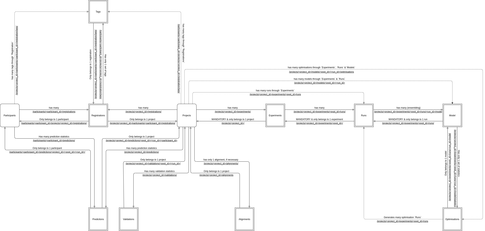
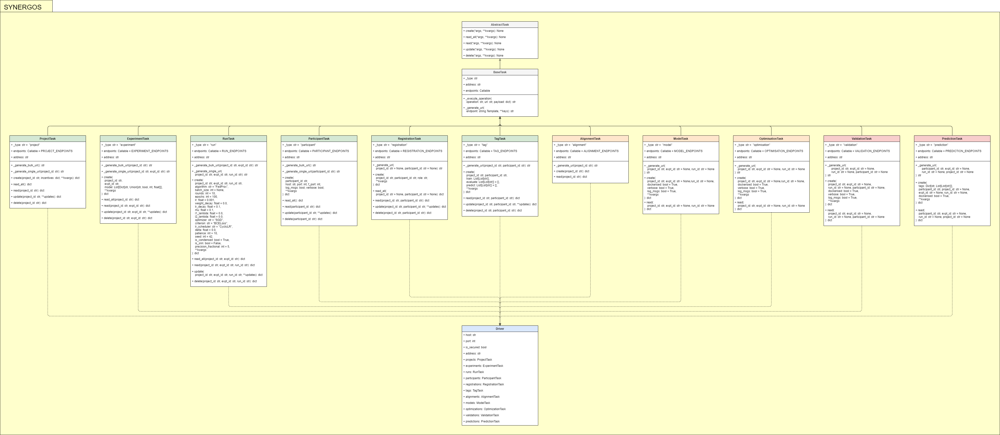

# Synergos

Interfacing package for interacting with TTP container in a Synergos network.

*REST-RPC Endpoint interactions supported in the Synergos Grid [V4]*

The Synergos grid prides itself on its modular system of deployment, comprizing of a duet of 2 packages - *Synergos-TTP* & *Synergos-Worker*. By having users install different components depending on their supposed role within the federated grid, most of the complexity associated with federated orchestrations are obscured completely from the users. 

However, this meant that the REST-RPC interface itself had many options and variations, and ironically, becoming somewhat of a complex beast itself, with 11 endpoints each supporting 4 variant operations, for a total of more than 40 routes to choose from! 

Thus, this inspired the creation of the Synergos Driver package, as a means to further simplify this interface.

## Installation
As Synergos is still under development, it has yet to be deployed on PyPi. Hence, the best way to use it is to install it in development mode in a local virtualenv.

```
# Download source repository
git clone https://github.com/aimakerspace/Synergos.git
git checkout dev
cd ./synergos

# Setup virtual environment
conda create -n synergos_env python=3.7

# Install in development mode
pip install -e .
```

## How to use?
Submitting jobs to the Synergos grid is simple with the driver interface.

```
from synergos import Driver

host = "0.0.0.0"
port = 5000

driver = Driver(host=host, port=port)

############################################################
# Phase 1: CONNECT - Submitting TTP & Participant metadata #
############################################################

# 1A. TTP controller creates a project

driver.projects.create(
    project_id="test_project",
    action="classify",
    incentives={
        'tier_1': [],
        'tier_2': [],
        'tier_3': []
    }
)


# 1B. TTP controller creates an experiment

driver.experiments.create(
    project_id="test_project",
    expt_id="test_experiment",
    model=[
        {
            "activation": "sigmoid",
            "is_input": True,
            "l_type": "Linear",
            "structure": {
                "bias": True,
                "in_features": 15, 
                "out_features": 1 
            }
        }
    ]
)


# 1C. TTP controller creates a run

driver.runs.create(
    project_id="test_project",
    expt_id="test_experiment",
    run_id="test_run",
    rounds=2, 
    epochs=1,
    base_lr=0.0005,
    max_lr=0.005,
    criterion="NLLLoss"
)


# 1D. Participants registers their servers' configurations

driver.participants.create(
    participant_id="test_participant_1",
    host='172.17.0.2',
    port=8020,
    f_port=5000,
    log_msgs=True,
    verbose=True
)

driver.participants.create(
    participant_id="test_participant_2",
    host='172.17.0.3',
    port=8020,
    f_port=5000,
    log_msgs=True,
    verbose=True
)


# 1E. Participants registers their role in a specific project

driver.registrations.create(
    project_id="test_project",
    participant_id="test_participant_1",
    role="guest"
)

driver.registrations.create(
    project_id="test_project",
    participant_id="test_participant_2",
    role="host"
)


# 1F. Participants registers their tags for a specific project

driver.tags.create(
    project_id="test_project",
    participant_id="test_participant_1",
    train=[
        ["non_iid_1"], 
        ["edge_test_missing_coecerable_vals"],
        ["edge_test_misalign"],
        ["edge_test_na_slices"]
    ],
    evaluate=[["iid_1"]]
)

driver.tags.create(
    project_id="test_project",
    participant_id="test_participant_2",
    train=[["non_iid_2"]]
)


#######################################################
# Phase 2: TRAIN - Alignment, Training & Optimisation #
#######################################################

# 2A. Perform multiple feature alignment to dynamically configure datasets and models for cross-grid compatibility

driver.alignments.create(project_id="test_project")


# 2B. Trigger training across the federated grid

model_resp = driver.models.create(
    project_id="test_project",
    expt_id="test_experiment",
    run_id="test_run"
)


# 2C. Trigger hyperparameter optimisation across the grid


################################################
# Phase 3: EVALUATE - Validation & Predictions #
################################################

# 3A. Perform validation(s) of combination(s)

driver.validations.create(
    project_id="test_project",
    expt_id="test_experiment",
    run_id="test_run"
)


# 3B. Perform prediction(s) of combination(s)

driver.predictions.create(
    tags={"test_project": [["iid_1"]]},
    participant_id="test_participant_1",
    project_id="test_project",
    expt_id="test_experiment",
    run_id="test_run"
)

```

## Further Documentations
For now, documentations are still in progress. In the meantime, use python's `help()` function to find out existing parameters to each of the task classes. In general, each task class has up to 5 methods -  `.create()`, `.read_all`, `.read()`, `.update()`, `.delete()`. 

*Interfacing components that make up the Synergos Driver package*

Alternatively, you may refer to the UML class diagram above for the list of functions supported for each component class.

In general, phase 1 operations (i.e. connection) have support for all methods, but phase 2 and 3 operations (i.e. training & evaluation) drop support for manual user updates or deletions of metadata entries within the grid, since all processes are dynamically generated by the system this point on.

